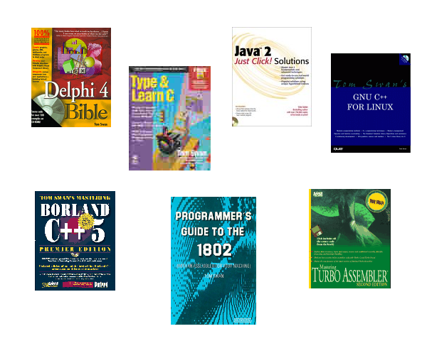

// README.adoc

= Collections

In this repository are collected ZIP files containing listings from programming tutorials I wrote and published roughly between 1980 and 2001.

Locate and download individual ZIP files from the `data` subfolder, or clone or download the entire repository. Unpack ZIP files to extract archived source code listings and other files.

- Update 2024-10-19 -- I am now extracting individual source code listing files from some of the older floppy disk images in the database. For example, _Learning C++,_ one of my more popular books of old, now includes in its ZIP archive the original two floppy disk images plus new folder `LCPP` containing all of the individual listing files as they would be after installing the diskettes. I was unable to provide these files because all the old sources had been destroyed many years ago, and like many of you, up until now, I was unable to run the original installation programs under newer versions of Microsoft Windows--until I discovered the following information, that is.

NOTE: To run old DOS .EXE and .COM programs found in some of these archives, you either need a vintage computer running MS-DOS or an early Windows, or you can do as I did: run the link:https://www.winehq.org/[Wine] and link:https://www.dosbox.com/[DOSbox] emulators in Linux. I used those tools, for example, to run some of the installation programs found in some older ZIP archive disk images.

- Update 2019-12-12 -- I'm very happy to report that I now making available 12 disk masters to many of my published books that came with "floppy" disks in various formats. Fetch and pull in the new entries, or clone the repository to get them all. See the full article for a list of the new master images.

The archived files here are exactly the same as those distributed with my books, or in some cases, sold separately by mail. Read on and select the ones you want. Or, download the entire repository to get them all.

I doubt that I'll come across much to add here, but there are some old things that I might still dig up and resurrect one day. If I find anything, I'll push it in. As always, many thanks to readers and fans new and old for your support! 

== Continue reading...

https://www.tomswan.com/articles/collections.html

- - -

// --------------------------------------------------

== Using the Files

Read the full article to select individual archives. Or, download or clone the repository if you want everything, including the published article's AsciiDoc source files. You can also extract files directly from the GitHub repository's `data` subfolder. Everything is here.

- - -

// --------------------------------------------------

== More Information

For more stuff, browse my repositories on GitHub. It's where I store all of my downloads, files and example programs, new and old. Everything is free for the taking. 

Please also follow the links below to visit my web site, GitHub and YouTube channels. Write to me at tom@tomswan.com. Good luck!

Website: https://www.tomswan.com

GitHub: https://github.com/TomSwan

YouTube: https://www.youtube.com/user/TomSwanPlaysGuitar
